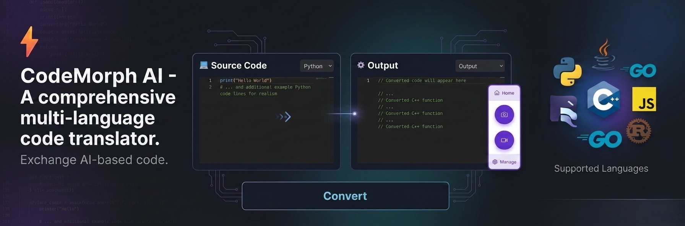
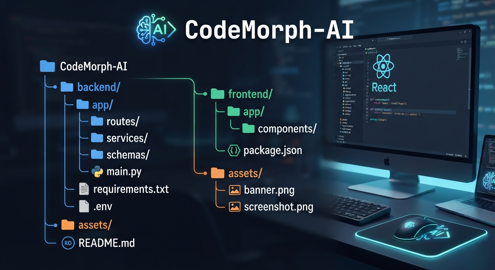

# ⚡ CodeMorph AI



> AI-powered multi-language code translator built with Next.js, FastAPI, and Gemini AI.

CodeMorph AI is an AI-based code conversion tool that converts source code from one programming language into another using artificial intelligence.

---

# 🚀 Features

- ✅ Multi-language code conversion
- ✅ Monaco code editor
- ✅ Modern dark UI
- ✅ Hello World templates for multiple languages
- ✅ Copy converted code
- ✅ Download converted code
- ✅ FastAPI backend
- ✅ Next.js frontend
- ✅ AI-powered conversion using Gemini API

---

# 🌐 Supported Languages

- Python
- C++
- JavaScript
- TypeScript
- Java
- C
- C#
- Go
- Rust
- PHP
- Kotlin
- Swift

---


# 🛠️ Tech Stack

## Frontend

- Next.js
- React
- TypeScript
- Tailwind CSS
- Monaco Editor

## Backend

- FastAPI
- Python
- Gemini AI API

---

# 📁 Project Structure



---

# 📦 Installation

## Clone Repository

```bash
git clone https://github.com/Zohaibcode740/CodeMorph-AI.git

cd CodeMorph-AI
```

## ⚙️ Backend Setup

Go to backend folder:

```cd backend```

Create virtual environment:

```python -m venv venv```

Activate virtual environment (Windows):

```venv\Scripts\activate```

Install dependencies:

```pip install -r requirements.txt```

Create a .env file inside the backend folder:

```GEMINI_API_KEY=your_api_key_here```

Run backend server:

```uvicorn app.main:app --reload```

Backend will run on:

```http://localhost:8000```

## 💻 Frontend Setup

Open another terminal:

```cd frontend```

Install packages:

```npm install```

Run development server:

```npm run dev```

Frontend will run on:

```http://localhost:3000```

##  🔑 API Key Setup

CodeMorph AI requires a Gemini AI API key.

Create your own Gemini API key and add it inside:

```backend/.env```

Example:

```GEMINI_API_KEY=your_key_here```

⚠️ Never upload your API key to GitHub.

Keep your .env file private.

## 🔒 Environment Variables

```Create .gitignore file and add:```
```
.env
backend/.env
frontend/.env
venv/
node_modules/
.next/
```

## 🤝 Contributing

Contributions are welcome.

Feel free to fork this project and improve it.

## 📜 License

MIT License

## 👨‍💻 Author

Zohaibcode740

Built with ❤️ using Next.js, FastAPI, and AI.
